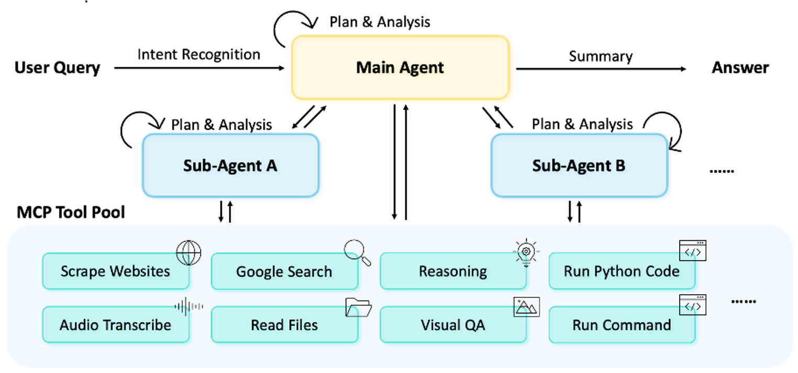
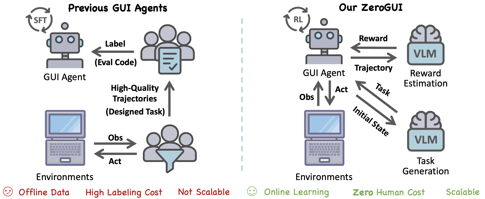

I am a first-year Ph.D. student in the [Department of Electronic Engineering](https://ee.tsinghua.edu.cn/) at [Tsinghua University](https://www.tsinghua.edu.cn/), where I am fortunate to be advised by [Prof. Jifeng Dai](https://jifengdai.org).

I have completed my bachelor's degree in the [Department of Physics](https://physics.tsinghua.edu.cn/) at Tsinghua in 2024. Additionally,I was an exchange student at the [Department of Information Technology and Electrical Engineering](https://ee.ethz.ch) at [ETH Zürich](https://ethz.ch/en.html) in 2023. I've served as an AI Research Intern at MiroMind (2025–2026), where I primarily focused on Agent framework development and frontier research.

My research focuses on multi-modal models and agents within the realms of deep learning, computer vision and LLM. These fields continuously present new challenges and opportunities for innovation, and I am excited to contribute to the community’s efforts in realizing Artificial General Intelligence.

Feel free to explore our team and works at: [Lab's website](https://fundamentalvision.github.io/)

I believe AI has the potential to revolutionize how people interact with one another and the world around them. The future is full of possibilities, and I am enthusiastic about exploring startup opportunities. If you are interested in this field, don’t hesitate to get in touch!

<!-- 
 -->

News
======

* **2025/08** : We have released an open-source agent🤖 framework that sets a new state-of-the-art. 
* **2024/09** : Joined Fundamental Vision Group as a Ph.D. student 🎉🎉.
* **2024/07** : Graduated from Tsinghua University with a bachelor's degree in Mathematics and Physics, and awarded **Excellent Graduate Student** (top 1.5%).

 
<!-- 
 -->

Selected Works
======

  <!-- Left Column: Image -->
  

    
  

  <!-- Right Column: Text -->
  

    <h3>MiroFlow: Towards High-Performance, Robust, and Open-Source Reproducible Agent Framework for General Research Tasks</h3>
    MiroMind Team, as <strong>core contributor</strong> 
    <a href="https://miromind.ai/blog/miroflow">Blog</a> / <a href="https://github.com/MiroMindAI/Miroflow">GitHub</a> / <a href="https://dr.miromind.ai">Demo</a> 
    <!-- Intro -->
  

  <!-- Left Column: Image -->
  

    
  

  <!-- Right Column: Text -->
  

    <h3>ZeroGUI: Automating Online GUI Learning at Zero Human Cost</h3>
    Yang, C.*, <strong>Su, S.*</strong>, Liu, S.*, Dong, X.*, Yu, Y.*, Su, W.*, ... & Dai, J. 
    Preprint / <a href="https://arxiv.org/abs/2505.23762">Paper</a> / <a href="https://huggingface.co/OpenGVLab/ZeroGUI-OSWorld-7B">Model</a> / <a href="https://github.com/OpenGVLab/ZeroGUI?tab=readme-ov-file">Code</a> 
    <!-- Intro -->
  

  <!-- Left Column: Image -->
  

    
  

  <!-- Right Column: Text -->
  

    <h3>HoVLE: Unleashing the Power of Monolithic Vision-Language Models with Holistic Vision-Language Embedding</h3>
    Tao, C.*, <strong>Su, S.*</strong>, Zhu, X.*, Zhang, C., Chen, Z., Liu, J., ... & Dai, J. 
    CVPR 2025 / <a href="https://arxiv.org/abs/2412.16158">Paper</a> / <a href="https://huggingface.co/OpenGVLab/HoVLE">Model</a> 
    <!-- HoVLE is a high-performance monolithic Vision-Language Model that uses a insightful holistic embedding module to effectively integrate vision and language, outperforming previous models. -->
  

  <!-- Left Column: Image -->
  

    
  

  <!-- Right Column: Text -->
  

    <h3>Learning 1D Causal Visual Representation with De-focus Attention Networks</h3>
    Tao, C.*, Zhu, X.*, <strong>Su, S.*</strong>, Lu, L., Tian, C., Luo, X., ... & Dai, J. 
    <a href="https://neurips.cc/virtual/2024/poster/95557">NeurIPS 2024</a> / <a href="https://arxiv.org/abs/2406.04342">Paper</a> / <a href="https://github.com/OpenGVLab/De-focus-Attention-Networks">Code</a> 
    <!-- intro here -->
  

 

Honors and Awards
======
* **2024/07** : Excellent Graduate Student (top 1.5%), Tsinghua University.
* **2022/12** : National Scholarship, Ministry of Education of the People's Republic of China.
* **2022/12** : Academic Excellence Scholarship, Tsinghua University.
* **2021/12** : National Scholarship, Ministry of Education of the People’s Republic of China.
* **2021/12** : Academic Excellence Scholarship, Tsinghua University.
* **2020/09** : Freshmen Scholarship, Tsinghua University.
* **2018/11** : The 35nd Chinese Physics Olympiad (CPhO) Gold Medal, Chinese Physical Society.

<!-- Internship Experience
======
Sensetime Research Internship

Perfessional Service
======
Teaching Assistant 
xxxx
-->

